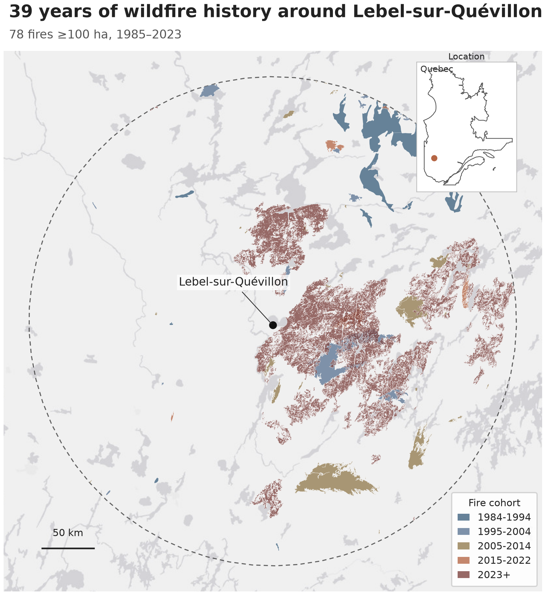
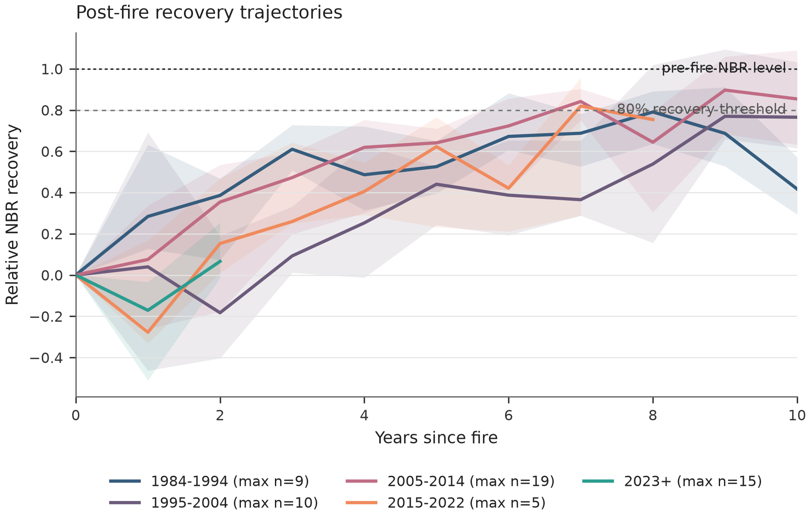
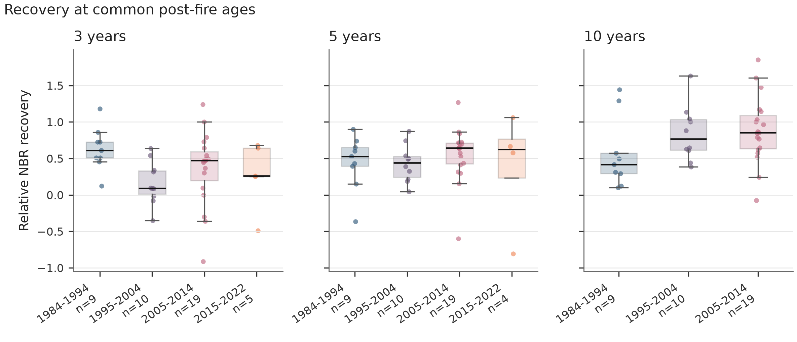
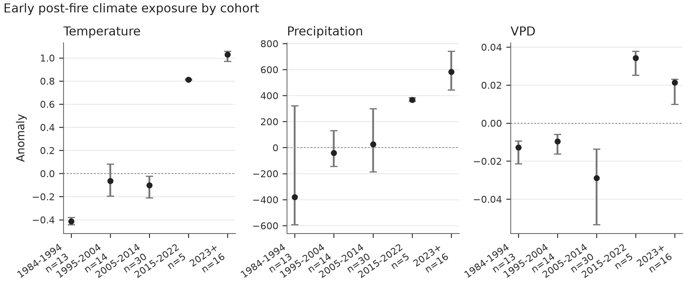
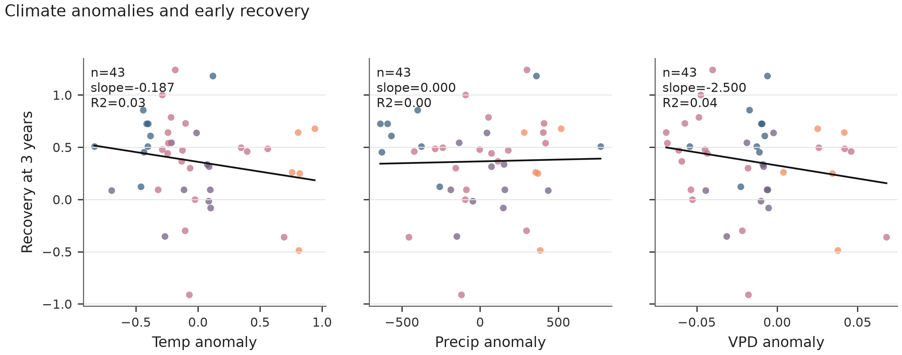
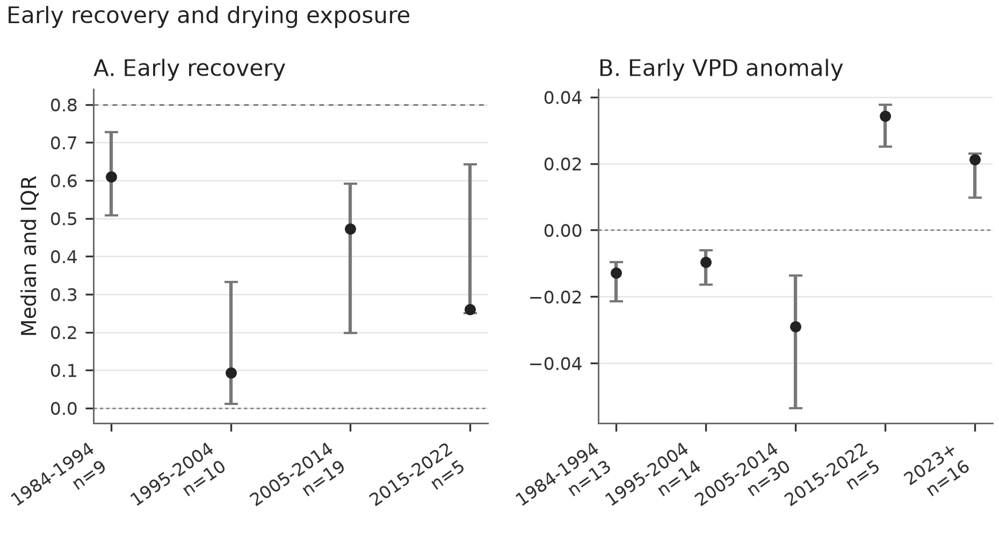

# Post-fire vegetation recovery near Lebel-sur-Quévillon

Wildfires burning today in Québec's boreal forest are beginning their recovery under a different climate than fires that burned four decades ago. But are forests actually recovering differently?

This repository follows 78 wildfire events from 1985-2023 within 150 km of Lebel-sur-Quévillon, Québec, using fire perimeters from the Canadian National Fire Database, Landsat vegetation indices, and ERA5-Land summer climate anomalies [1,2,4]. It compares fire cohorts at the same post-fire ages so that older and newer fires are not mixed across unequal recovery windows.

**The post-fire climate signal has changed more clearly than the recovery signal.**

## Research question

How has post-fire vegetation recovery changed under increasingly warm and dry climate conditions around Lebel-sur-Quévillon since 1984?

## 39 years of fire history



The study area is a 150 km radius around Lebel-sur-Quévillon. The analysis retains wildfire perimeters from the official Canadian National Fire Database where fires intersect the study area, occurred from 1985-2023, and were at least 100 ha [1].

The fire cohorts provide a long-term natural comparison: fires from the 1980s and 1990s can be compared with more recent events, while still respecting the fact that recent fires have had less time to recover.

## How did vegetation recover?



Vegetation recovery is measured with relative Normalized Burn Ratio (NBR) recovery. NBR and differenced NBR (dNBR) are widely used Landsat-based spectral measures for mapping fire effects and post-fire change [2,3]. A relative recovery value of 0 represents the fire-year NBR condition, while 1 represents return to the pre-fire NBR baseline. Values above 1 are possible and are not capped, because post-fire vegetation can exceed the pre-fire spectral baseline.



At three years after fire, median relative NBR recovery was:

- 1984-1994: 0.61
- 1995-2004: 0.09
- 2005-2014: 0.47
- 2015-2022: 0.26
- 2023+: unavailable because sufficient recovery time has not elapsed

These values do not show a simple monotonic temporal pattern. In this dataset, comparable-age spectral recovery varies substantially among fire cohorts, but it does not support a claim that recent forests are progressively recovering worse.

## The post-fire climate changed



The atmospheric context during early recovery changed more clearly than the recovery trajectories themselves. Median early post-fire Vapor Pressure Deficit (VPD) anomaly is negative for the 1984-1994, 1995-2004, and 2005-2014 cohorts, but positive for the two most recent cohorts: 2015-2022 and 2023+.

Vapor Pressure Deficit (VPD) is the difference between saturation vapor pressure and actual vapor pressure. Higher VPD indicates greater atmospheric evaporative demand, which can increase the potential for vegetation water loss and water stress when water supply is limiting [5]. VPD is not synonymous with drought. VPD is not soil moisture. High VPD alone does not prove physiological water stress.

The observed shift in VPD anomalies is ecologically relevant because it shows that recent fire cohorts began recovery under a different atmospheric moisture-demand context than older cohorts. It does not show that VPD caused the observed recovery patterns.

## But climate alone does not explain recovery



Simple bivariate relationships between three-year recovery and early post-fire climate anomalies explain little of the observed between-fire variability:

- Temperature anomaly: slope = -0.187, R² = 0.03
- Precipitation anomaly: slope = 0.00003, R² = 0.00
- VPD anomaly: slope = -2.500, R² = 0.04

These are associations only. The climatic context clearly changed, but variation in recovery among fires cannot be reduced to a simple one-variable climate response.

## Synthesis



Recent fires are beginning recovery in a different atmospheric environment, especially with respect to VPD and temperature. Comparable-age spectral recovery, however, does not show a corresponding simple or monotonic decline through time.

Detecting a changing post-fire climate is easier here than attributing fire-level recovery trajectories to climate alone.

## Quality control

Normalized recovery requires a detectable fire-related NBR decline. The disturbance signal is:

```text
dNBR = NBR_pre - NBR_fire
```

Relative recovery is:

```text
relative_recovery_nbr = (NBR_t - NBR_fire) / (NBR_pre - NBR_fire)
```

This analysis requires `dNBR >= 0.10` for normalized recovery metrics. This is an analysis-level minimum disturbance-signal and numerical-stability criterion, not a universal wildfire-severity threshold.

Fires with low or negative `dNBR` are excluded from normalized recovery because the denominator is too small or inconsistent with a detectable fire-related NBR decline, making normalized recovery unstable or uninterpretable. Of the 78 fire events, 58 pass this criterion, 20 are excluded from normalized recovery, and the valid percentage is 74.36%. Excluded fires remain in the fire-history and climate analyses. Normalized recovery is not capped at 1.0.

## Methods and workflow

```text
NFDB fire perimeters
+
Landsat Collection 2
+
ERA5-Land
v
age-standardized recovery metrics
v
climate/recovery comparisons
```

NBR is the primary recovery indicator, and NDVI is retained as a secondary indicator. The pre-fire baseline is the median of years -3, -2, and -1 before fire. Recovery comparisons use exact post-fire ages of 3, 5, and 10 years; missing ages are not interpolated or substituted.

Fire perimeters are prepared locally as a compact GeoJSON and passed to the Earth Engine Python API. The workflow does not require a permanent uploaded Earth Engine fire asset.

## Limitations

- Spectral recovery is not equivalent to structural forest recovery.
- Observational analysis cannot establish climate causality.
- Recent fires have shorter recovery windows.
- Fire-level aggregation hides within-fire heterogeneity.
- The `dNBR >= 0.10` criterion means normalized recovery inference applies to fires with a detectable NBR decline.

## Reproduce

Install dependencies and run the full pipeline:

```bash
python3 -m pip install -r requirements.txt
python3 src/run_pipeline.py
```

To rerun only the corrected downstream QA, metrics, models, and figures from existing extracted tables:

```bash
python3 src/build_analysis_dataset.py
python3 src/analyze_recovery.py
python3 src/generate_final_figures.py
```

Earth Engine must be authenticated with a registered Earth Engine project/account before the full Landsat and ERA5-Land extraction can be rerun.

## Data sources

- Canadian National Fire Database fire perimeter polygons, Natural Resources Canada / Canadian Forest Service [1]
- Landsat Collection 2 Level-2 Surface Reflectance, U.S. Geological Survey [2]
- ERA5-Land hourly reanalysis, ECMWF / Copernicus Climate Change Service [4]

## How to cite this repository

Vega Escobar, A. (2026). *Post-fire vegetation recovery near Lebel-sur-Quévillon* [GitHub repository]. GitHub. [https://github.com/geoforestdata/lebel-fire-vegetation-recovery](https://github.com/geoforestdata/lebel-fire-vegetation-recovery)

<details>
<summary>BibTeX</summary>

```bibtex
@misc{vegaescobar2026postfire,
  author       = {Vega Escobar, Alejandro},
  title        = {Post-fire vegetation recovery near Lebel-sur-Quévillon},
  year         = {2026},
  howpublished = {GitHub repository},
  url          = {https://github.com/geoforestdata/lebel-fire-vegetation-recovery}
}
```

</details>

## References

[1] Canadian Forest Service. 2020. *Canadian National Fire Database - Agency Fire Data*. Natural Resources Canada, Canadian Forest Service, Northern Forestry Centre, Edmonton, Alberta. [https://cwfis.cfs.nrcan.gc.ca/ha/nfdb](https://cwfis.cfs.nrcan.gc.ca/ha/nfdb)

[2] Earth Resources Observation and Science (EROS) Center. 2020. Landsat Collection 2 Level-2 Surface Reflectance datasets. U.S. Geological Survey:
Landsat 4-5 Thematic Mapper Level-2, Collection 2 [dataset]. [https://doi.org/10.5066/P9IAXOVV](https://doi.org/10.5066/P9IAXOVV);
Landsat 7 Enhanced Thematic Mapper Plus Level-2, Collection 2 [dataset]. [https://doi.org/10.5066/P9C7I13B](https://doi.org/10.5066/P9C7I13B);
Landsat 8-9 Operational Land Imager / Thermal Infrared Sensor Level-2, Collection 2 [dataset]. [https://doi.org/10.5066/P9OGBGM6](https://doi.org/10.5066/P9OGBGM6).

[3] Key, C. H., and Benson, N. C. 2006. Landscape Assessment (LA). In Lutes, D. C., Keane, R. E., Caratti, J. F., Key, C. H., Benson, N. C., Sutherland, S., and Gangi, L. J. *FIREMON: Fire Effects Monitoring and Inventory System*. Gen. Tech. Rep. RMRS-GTR-164-CD. Fort Collins, CO: U.S. Department of Agriculture, Forest Service, Rocky Mountain Research Station, LA-1-LA-55. [https://doi.org/10.2737/RMRS-GTR-164](https://doi.org/10.2737/RMRS-GTR-164)

[4] Muñoz-Sabater, J., Dutra, E., Agustí-Panareda, A., Albergel, C., Arduini, G., Balsamo, G., Boussetta, S., Choulga, M., Harrigan, S., Hersbach, H., Martens, B., Miralles, D. G., Piles, M., Rodríguez-Fernández, N. J., Zsoter, E., Buontempo, C., and Thépaut, J.-N. 2021. ERA5-Land: a state-of-the-art global reanalysis dataset for land applications. *Earth System Science Data*, 13, 4349-4383. [https://doi.org/10.5194/essd-13-4349-2021](https://doi.org/10.5194/essd-13-4349-2021)

[5] Grossiord, C., Buckley, T. N., Cernusak, L. A., Novick, K. A., Poulter, B., Siegwolf, R. T. W., Sperry, J. S., and McDowell, N. G. 2020. Plant responses to rising vapor pressure deficit. *New Phytologist*, 226, 1550-1566. [https://doi.org/10.1111/nph.16485](https://doi.org/10.1111/nph.16485)
